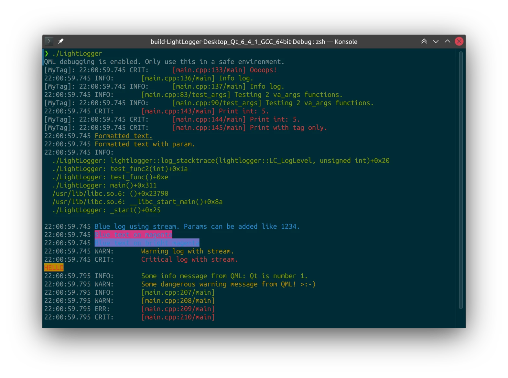

LightLogger
===========

Facilities for logging on Linux, Windows, Windows RT, Mac OS X, Android, iOS and Linux Embedded. Should be possible to build with most compilers and also for micro-controllers like Raspberry Pi pico.

Support for Qt types, C++, Java, Swift, QML.

</img>
